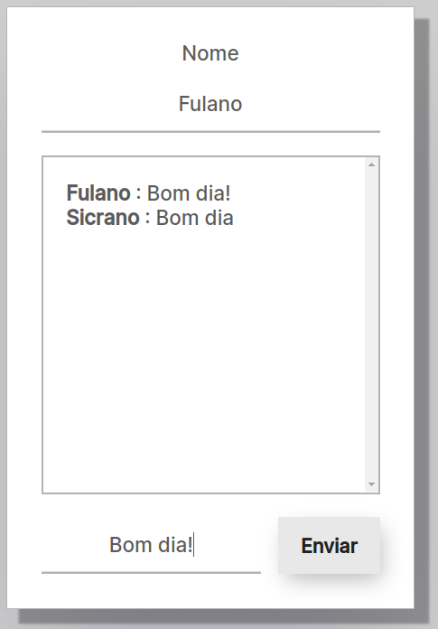
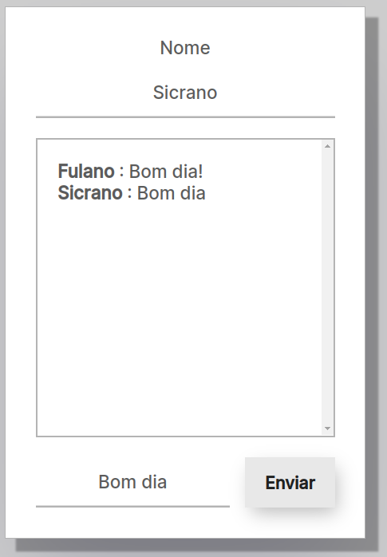

<h2 align="center">Chat</h2>  

Chat feito utilizando WebSocket.

  
  

 

## Tecnologias usadas
* HTML
* CSS
* JavaScript
* jQuery
* [Socket.IO](https://socket.io/)

## Como rodar
1. `yarn` ou `npm i`  
2. `yarn start` ou `npm run start`
